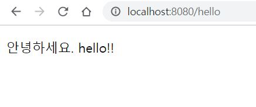
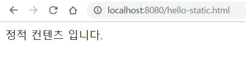
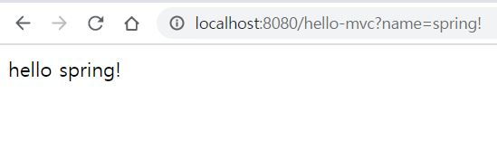
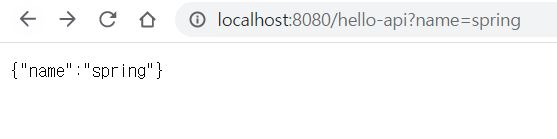
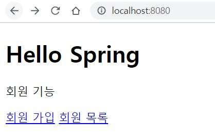
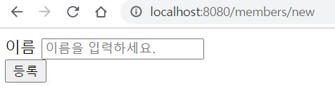
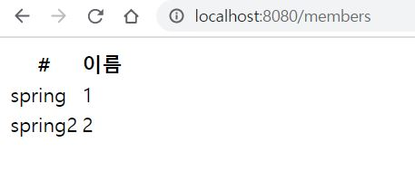
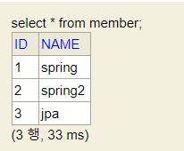
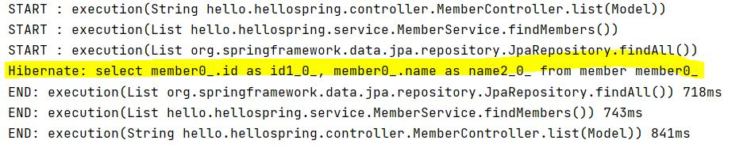
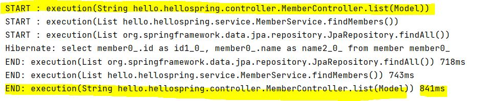

# hello-spring

Spring &amp; Spring Boot 실습 프로젝트

 

### 📷실습 화면 기록🎞

💗 2021/02/10 View 환경 설정

💗 2021/02/10 정적 컨텐츠

💗 2021/02/11 MVC와 템플릿 엔진

💗 2021/02/11 API

💗 2021/02/15 회원 웹 기능 - 홈 화면

💗 2021/02/15 회원 웹 기능 - 등록

💗 2021/02/15 회원 웹 기능 - 조회

💗 2021/02/16 순수 JDBC

💗 2021/02/16 JPA & 스프링 데이터 JPA 실습

💗 2021/02/16 AOP 적용 (시간 측정 로직)

